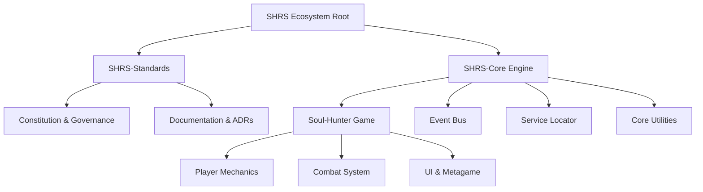

# Soul-Hunter: Architecture Tree & Milestones

**Status:** Approved (Pre-Construction Blueprint)  
**Authority:** Chief Systems Architect  

*As per the SHRS Constitution (Architecture Before Construction), we do not write game code or ask "what to build" without first defining the root tree and milestones.*

## 1. The Root Tree (Ecosystem Hierarchy)

## 2. Milestones (The Progressive Execution Plan)

### Milestone 1 (M1): Core Engine Foundation
*Before a player can move, the world must exist.*
- [x] Initialize Unity Project Architecture (Bootstrap/Installers)
- [x] Event Bus Architecture (Technical Doc approved in Sprint-001)
- [x] Service Locator Implementation
- [x] Input Handling System

### Milestone 2 (M2): Core Locomotion & Physics
*The entity must exist and interact with space.*
- [x] Player Controller (State Machine)
- [x] Collision & Environment Interaction
- [x] Animation Rigging & States

### Milestone 3 (M3): The Combat Loop
*The entity must fulfill its purpose.*
- [x] Weapon System / Attack Hitboxes
- [x] Enemy AI (Basic Behavior Tree/FSM)
- [x] Health & Damage System

### Milestone 4 (M4): Metagame & Persistence
*The world must remember.*
- [x] Save / Load System
- [x] UI / HUD integration
- [x] Scene Management & Loading

## 3. Engineering Rule Enforcement
We will not proceed to M2 until M1 is 100% complete, reviewed, and merged. Every sub-task inside a Milestone MUST have a corresponding GDD or Tech Doc in `SHRS-Standards` before a Unity C# script is created.
