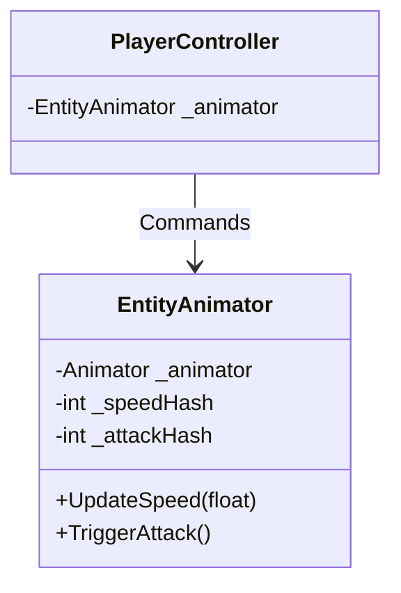

# Animation Rigging & States - Technical Doc

**Author:** Chief Systems Architect  
**Status:** Approved (Sprint-004, M2)  
**Target Engine:** Unity 6 / Unity 2022 LTS  
**Namespace:** `SoulHunter.Gameplay.Animation`  

## 1. Architecture Overview
Tying animation logic directly into the Player Controller breaks the Single Responsibility Principle. If the animator changes, the controller breaks. To prevent this, we introduce the `EntityAnimator` pattern. The Controller dictates *what* is happening, while the `EntityAnimator` dictates *how* it looks.

## 2. Core Components
- **`EntityAnimator` (MonoBehaviour)**: A decoupled animation wrapper attached to the entity's visual mesh (which usually has the `Animator` component).

## 3. Zero-Allocation (Hybrid) Compliance
Unity's `animator.SetFloat("Speed", 5f)` generates garbage because of the string allocation. 
To comply with our Hybrid architecture, the `EntityAnimator` MUST cache all string parameters into integers using `Animator.StringToHash("Speed")` during `Awake()`. All runtime animation updates will use these cached hashes.

## 4. State Machine Integration
The `PlayerController` will grab a reference to the `EntityAnimator`. Inside the state machine:
- `PlayerIdleState` will call `_animator.UpdateSpeed(0f)`.
- `PlayerRunState` will call `_animator.UpdateSpeed(currentSpeed)`.
This keeps the logic beautifully isolated and passes the 2036 Test.
