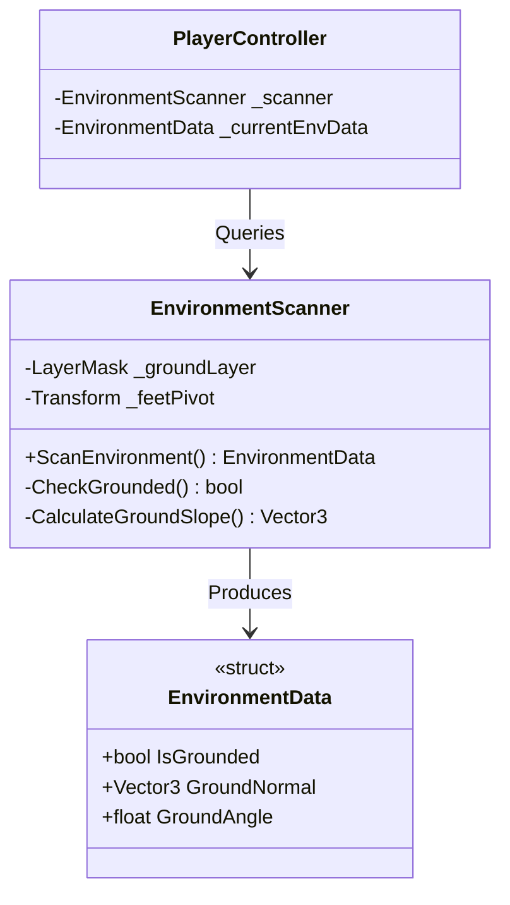

# Collision & Environment Interaction - Technical Doc

**Author:** Chief Systems Architect  
**Status:** Approved (Sprint-004, M2)  
**Target Engine:** Unity 6 / Unity 2022 LTS (3D Physics)  
**Namespace:** `SoulHunter.Gameplay.Physics`  

## 1. Architecture Overview
In traditional Unity games, Player Controllers are often bloated with hundreds of `Physics.Raycast` lines. To maintain our Hierarchical Single Responsibility and Hybrid ECS principles, Collision detection is entirely decoupled into a reusable `EnvironmentScanner` component.

## 2. Core Components
- **`EnvironmentScanner` (MonoBehaviour)**: Attached to the physical entity (Player or Enemy). It performs zero-allocation physics checks (like `Physics.RaycastNonAlloc` or `Physics.CheckSphere`).
- **`EnvironmentData` (Struct)**: A clean, zero-allocation data packet containing all information about the entity's surroundings (Is it grounded? What is the slope angle?).

## 3. Hybrid System / Zero-Allocation Compliance
- We strictly avoid APIs like `Physics.RaycastAll` which generate garbage collections arrays.
- `EnvironmentData` is a `struct`. By passing this struct to the State Machine (`PlayerRunState`), the states can modify velocity based on slopes (GroundNormal) without ever directly touching the Unity Physics API.
- **Reusability**: Because the `EnvironmentScanner` does not know it belongs to a "Player", it can be attached to Enemy AI in M3 without rewriting any collision code.

## 4. State Machine Integration
During `FixedUpdate()`, the `PlayerController` will call `_scanner.ScanEnvironment()` and pass the resulting `EnvironmentData` struct to the active `IPlayerState`. The `PlayerRunState` will use this data to prevent sliding down slopes or getting stuck on walls.
