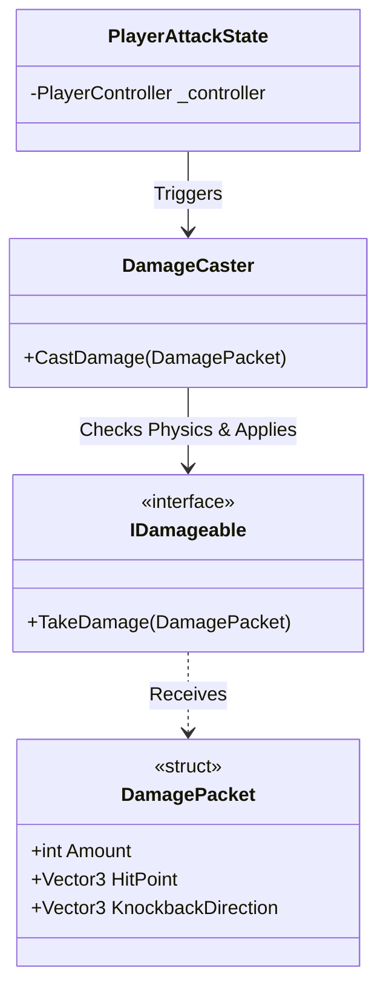

# Combat System (Weapons & Hitboxes) - Technical Doc

**Author:** Chief Systems Architect  
**Status:** Approved (Sprint-005, M3)  
**Target Engine:** Unity 6 / Unity 2022 LTS  
**Namespace:** `SoulHunter.Gameplay.Combat`  

## 1. Architecture Overview
Combat in Soul-Hunter must be precise, performant, and completely decoupled. We separate the "intent to attack", the "physical hitbox", and the "health/damage receiver".

## 2. Core Components
- **`DamageCaster`**: A MonoBehaviour attached to the weapon or attack pivot. It uses zero-allocation physics (e.g., `OverlapBoxNonAlloc`) to find targets.
- **`IDamageable`**: An interface attached to anything that can take damage (Enemies, Breakable pots, Player).
- **`DamagePacket` (Struct)**: Contains all damage data. Being a struct ensures there's no heap allocation (Garbage Collection) when dealing damage, complying with our Hybrid ECS rules.

## 3. The Combat Flow
1. The `EventBus` receives a `PlayerAttackEvent` (Triggered by InputService).
2. `PlayerController` changes state to `PlayerAttackState`.
3. `PlayerAttackState` tells the `EntityAnimator` to play the attack animation.
4. During the animation, an Animation Event (or timeline) tells the `DamageCaster` to activate.
5. `DamageCaster` does a `NonAlloc` physics check.
6. For every `Collider` hit, it tries to get `IDamageable`. If found, it passes a `DamagePacket`.

## 4. Reusability (The 2036 Test)
Because `DamageCaster` only looks for `IDamageable`, it can be attached to Enemy weapons too! If an enemy swings a sword, the exact same `DamageCaster` script will detect the Player's `IDamageable` interface. Write once, use everywhere.
