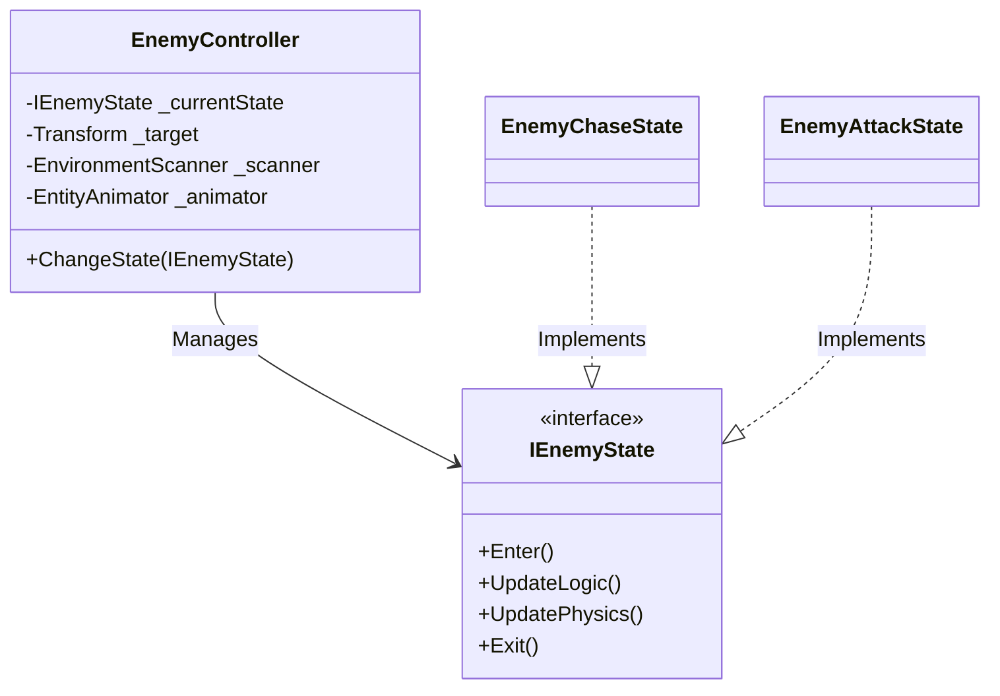

# Enemy AI (State Machine) - Technical Doc

**Author:** Chief Systems Architect  
**Status:** Approved (Sprint-005, M3)  
**Target Engine:** Unity 6 / Unity 2022 LTS (Using NavMesh or Simple Physics)  
**Namespace:** `SoulHunter.Gameplay.AI`  

## 1. Architecture Overview
To maintain code reusability, the Enemy AI will mirror the Player's State Machine architecture. Enemies will not have massive spaghetti code scripts. Instead, an `EnemyController` will manage independent states (Idle, Chase, Attack).

## 2. Reusing Existing Systems (The 2036 Test)
The true power of our architecture shines here:
- **Animations:** The `EnemyController` will use the exact same `EntityAnimator` script we built for the Player.
- **Environment/Slopes:** The Enemy will use the exact same `EnvironmentScanner` we built for the Player.
- **Combat:** When the Enemy attacks, it will activate the exact same `DamageCaster` we built for the Player.

By decoupling these modules, the Enemy AI only needs to worry about *making decisions*, not *how to execute them*.

## 3. The Decision Loop (States)
- **`EnemyIdleState`**: Waits or patrols. Looks for the Player.
- **`EnemyChaseState`**: Moves towards the Player using Unity's NavMesh (or simple vector math if 2D/TopDown).
- **`EnemyAttackState`**: When close enough, stops moving and triggers the `EntityAnimator.TriggerAttack()`, which in turn fires the `DamageCaster`.

## 4. Hybrid System Compliance
No continuous memory allocations in the `Update` loop. Pathfinding or distance checks should be optimized (using sqrMagnitude instead of Vector3.Distance).
