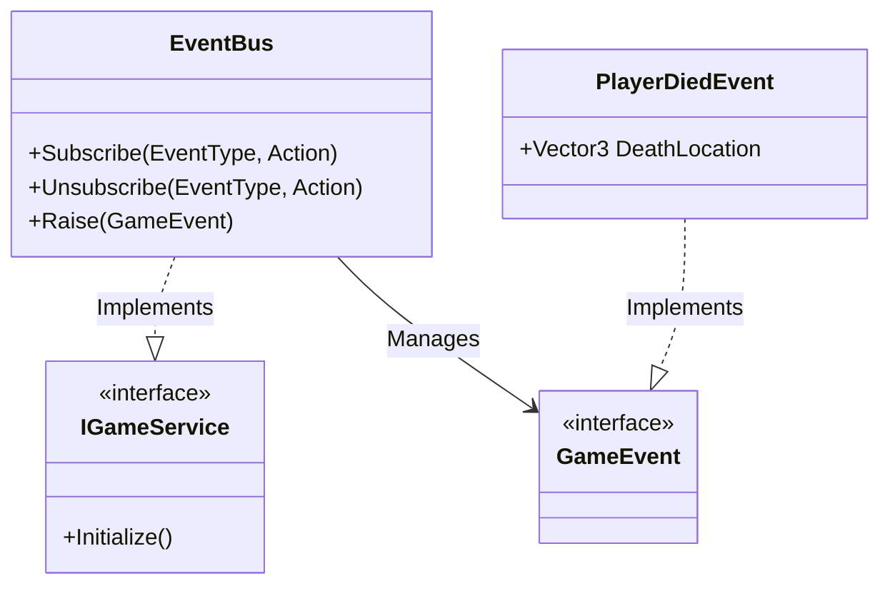

# Event Bus System - Technical Doc

**Author:** Chief Systems Architect  
**Status:** Approved (Sprint-001)  
**Target Engine:** Unity 6 / Unity 2022 LTS  
**Namespace:** `SoulHunter.Core.Events`  

## 1. Architecture Overview
The Event Bus is the central nervous system of Soul-Hunter. It decouples the Gameplay systems from UI and Audio, ensuring that systems communicate via events rather than direct references.

## 2. Core Components
This is a pure C# architecture and does not require Unity `MonoBehaviour` components to function. It is initialized by the `BootstrapInstaller`.

## 3. Public API / Methods

### `Subscribe<T>(Action<T> handler)`
Registers a listener for a specific `GameEvent`.

### `Raise(GameEvent e)`
Broadcasts the event to all subscribed listeners.

## 4. Performance / Optimization Notes
!!! warning "Performance Note"
    Avoid raising hundreds of events per frame (e.g., inside `Update()`). The Event Bus is designed for discrete state changes (Death, Spawn, Level Complete), not continuous data streams.
