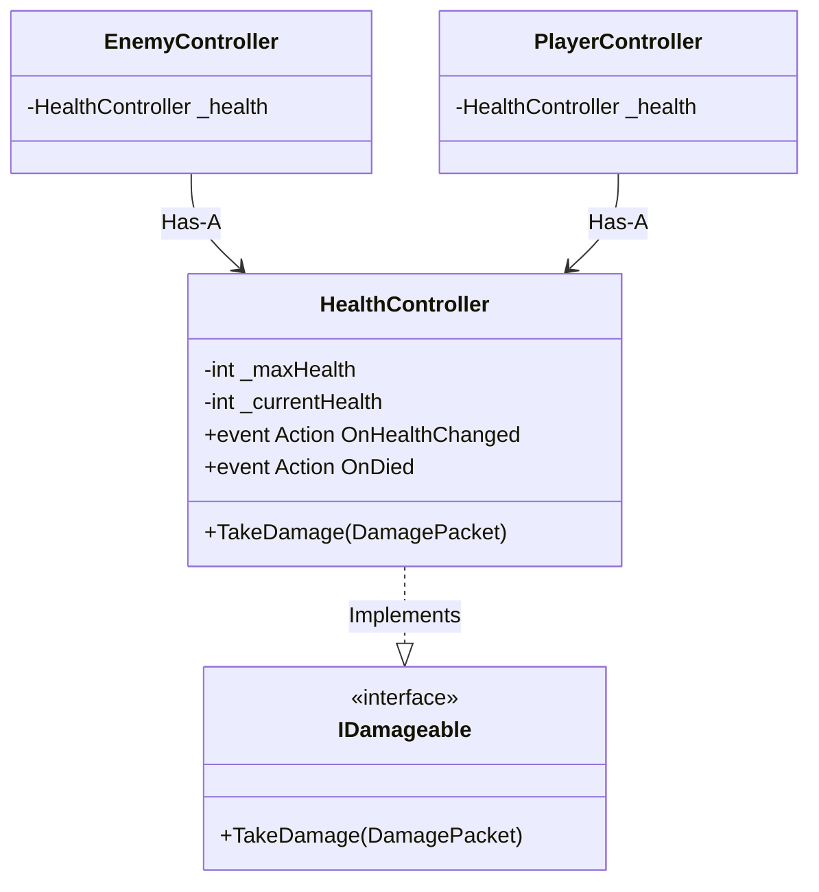

# Health & Damage System - Technical Doc

**Author:** Chief Systems Architect  
**Status:** Approved (Sprint-005, M3)  
**Target Engine:** Unity 6 / Unity 2022 LTS  
**Namespace:** `SoulHunter.Gameplay.Combat`  

## 1. Architecture Overview
Health is a universal concept. Instead of writing health logic inside `PlayerController` and rewriting it inside `EnemyController`, we use a dedicated `HealthController` component that implements our `IDamageable` interface.

## 2. Core Components
- **`HealthController` (MonoBehaviour)**: The sole source of truth for an entity's life. It implements `IDamageable`.

## 3. Decoupling and Event-Driven UI (2036 Test)
- When health changes, `HealthController` does NOT try to find a UI slider. It simply fires a standard C# event (`OnHealthChanged`).
- A completely separate UI script will listen to this event. If the UI script is deleted, the game still compiles and runs perfectly. This is the hallmark of professional architecture.

## 4. Hybrid System Compliance
The `TakeDamage` method accepts the `DamagePacket` struct. Because structs are passed by value and allocated on the stack, taking damage (even 100 times a frame) will generate 0 garbage on the heap.
