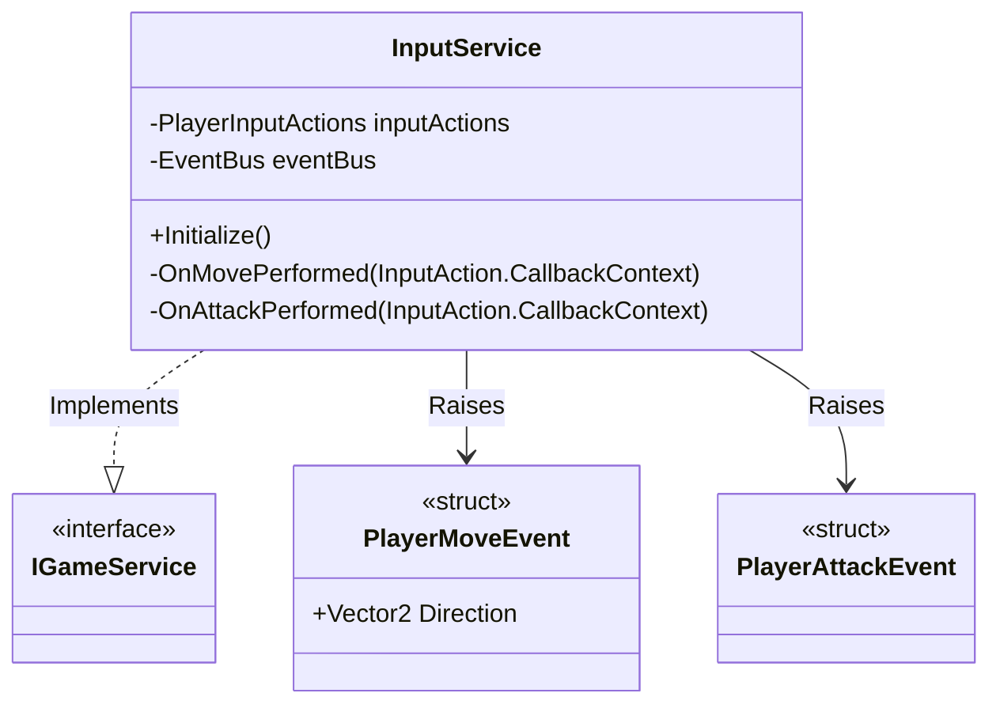

# Input Handling System - Technical Doc

**Author:** Chief Systems Architect  
**Status:** Approved (Sprint-003)  
**Target Engine:** Unity 6 / Unity 2022 LTS (Using New Input System Package)  
**Namespace:** `SoulHunter.Core.Input`  

## 1. Architecture Overview
The Input Handling System is responsible for capturing raw player inputs (Keyboard, Mouse, Gamepad) and translating them into decoupled Game Events. By utilizing the `EventBus`, the Input System ensures that the Player Controller does not need to poll for input every frame, aligning with our Hybrid/Event-Driven architecture.



## 2. Core Components
- **`InputService`**: A core service managed by the `GameServices` Service Locator. It listens to Unity's New Input System callbacks.
- **`PlayerInputActions`**: The generated C# class from Unity's Input Actions Asset.

## 3. Hybrid System / ECS Compliance
- **Zero-Allocation**: Input events (like `PlayerMoveEvent` and `PlayerAttackEvent`) MUST be implemented as `structs` that inherit from `IGameEvent`. This prevents garbage collection spikes when moving the character every frame.
- **Decoupling**: The Input Service only *raises* events. The Player Controller or combat systems will *subscribe* to these events. They do not know about each other directly.

## 4. Integration with Bootstrap
The `InputService` will be instantiated and registered inside `BootstrapInstaller.cs` alongside the `EventBus`.

```csharp
// Inside BootstrapInstaller.cs
var eventBus = gameServices.Get<EventBus>();
gameServices.Register(new InputService(eventBus));
```
