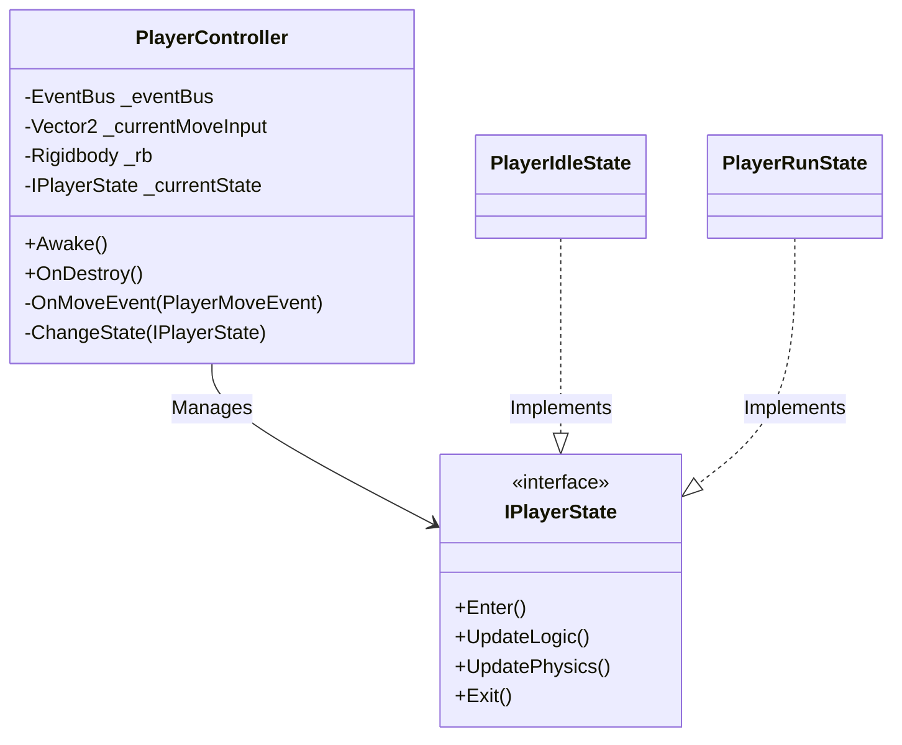

# Player Controller (State Machine) - Technical Doc

**Author:** Chief Systems Architect  
**Status:** Approved (Sprint-004, M2)  
**Target Engine:** Unity 6 / Unity 2022 LTS  
**Namespace:** `SoulHunter.Gameplay.Player`  

## 1. Architecture Overview
The Player Controller is responsible for managing the physical locomotion and states of the player character. True to our Hybrid Architecture, it **does not** read input directly. Instead, it subscribes to the decoupled `EventBus` and reacts to zero-allocation structs (e.g., `PlayerMoveEvent`).

## 2. Event-Driven Locomotion (Hybrid ECS Compliance)
The `PlayerController` will fetch the `EventBus` via the Service Locator (`GameServices.Get<EventBus>()`) during `Awake()`.
It will subscribe to `PlayerMoveEvent`. When the event fires, it simply caches the `Vector2` direction.
During `FixedUpdate()`, the active State (e.g., `PlayerRunState`) will apply physics forces based on this cached direction.

## 3. The State Machine Pattern
To avoid "Spaghetti Code" (massive switch statements or nested if-else blocks), locomotion is broken into discrete states.
- **`PlayerIdleState`**: Active when there is no move input.
- **`PlayerRunState`**: Active when movement input is detected. Applies velocity to the Rigidbody.

## 4. Single Responsibility Principle
The `PlayerController` script itself only routes data. It passes the current input and Rigidbody reference to the active `IPlayerState`, which handles the actual math and physics. This ensures the 2036 Test is passed (the code is highly readable and isolated).
