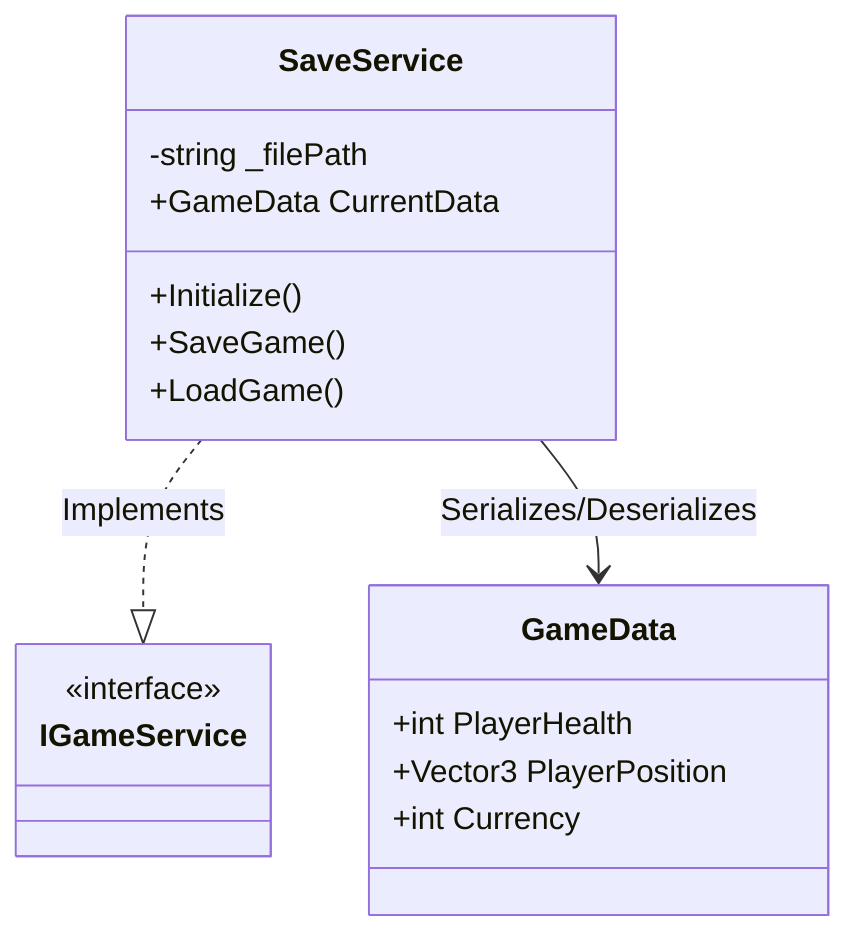

# Save / Load System (Persistence) - Technical Doc

**Author:** Chief Systems Architect  
**Status:** Approved (Sprint-006, M4)  
**Target Engine:** Unity 6 / Unity 2022 LTS  
**Namespace:** `SoulHunter.Core.Persistence`  

## 1. Architecture Overview
To avoid data scattered across a dozen scripts (PlayerPrefs spaghetti), we centralize persistence. The `SaveService` is a core engine service registered inside the Service Locator (`GameServices`).

## 2. Core Components
- **`SaveService`**: Managed by `BootstrapInstaller`. Handles disk I/O (System.IO.File) writing/reading JSON.
- **`GameData`**: A simple C# class (not a MonoBehaviour) that represents the exact state of the game. It acts as the central state model.

## 3. Hybrid System / ECS Compliance
- Instead of finding every object in the scene and saving it, we maintain a centralized `GameData` model. When the game loads, systems pull data from `SaveService.CurrentData`.
- Disk writes (JSON serialization) generate garbage. Therefore, `SaveGame()` is explicitly called at checkpoints, not during active gameplay/combat loops, preserving our zero-allocation runtime.

## 4. Integration with Bootstrap
The `SaveService` will be registered inside `BootstrapInstaller.cs` just like the `EventBus` and `InputService`.
