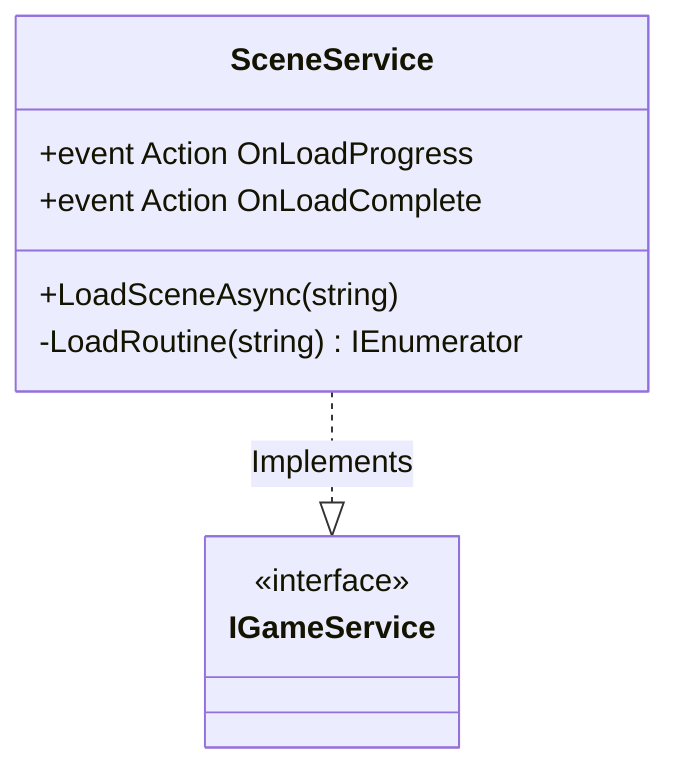

# Scene Management & Loading - Technical Doc

**Author:** Chief Systems Architect  
**Status:** Approved (Sprint-006, M4)  
**Target Engine:** Unity 6 / Unity 2022 LTS  
**Namespace:** `SoulHunter.Core.Scenes`  

## 1. Architecture Overview
Directly calling `SceneManager.LoadScene("Level2")` scattered across UI buttons and trigger volumes leads to a fragmented and unmanageable codebase. We centralize this logic into a `SceneService`.

## 2. Core Components
- **`SceneService`**: A core service managed by `GameServices` (Locator). It handles the asynchronous transition between levels.

## 3. Asynchronous Execution (2036 Test)
- `SceneManager.LoadSceneAsync` is used exclusively. The game will never "freeze" while loading a new level.
- The `SceneService` fires an `OnLoadProgress` event (0.0 to 1.0) so the UI can update a loading bar without tightly coupling the UI to the SceneManager.

## 4. Integration with Bootstrap
Like `SaveService` and `EventBus`, the `SceneService` will be registered inside `BootstrapInstaller.cs` during game startup.
