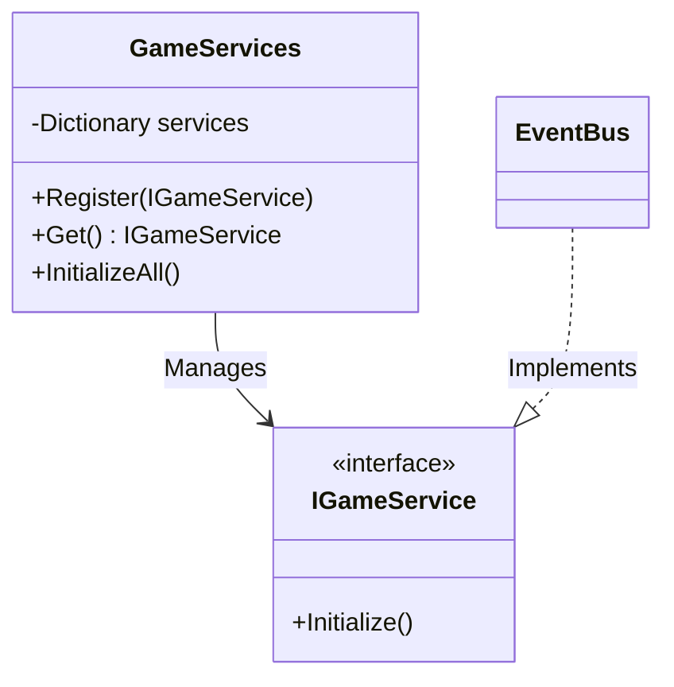

# Service Locator System - Technical Doc

**Author:** Chief Systems Architect  
**Status:** Approved (Sprint-003)  
**Target Engine:** Unity 6 / Unity 2022 LTS  
**Namespace:** `SoulHunter.Core.Services`  

## 1. Architecture Overview
The Service Locator (`GameServices`) is the central registry for all core engine services in Soul-Hunter (like the Event Bus, Time Service, Save Service). It provides a decoupled way for systems to find each other without relying on static singletons, which aligns perfectly with our Hybrid Architecture principles.

## 2. Core Components
- **`GameServices`**: The container that holds references to all active services.
- **`IGameService`**: The interface that all services must implement to be managed by the locator.

## 3. Public API / Methods
- **`Register<T>(T service)`**: Adds a service to the registry.
- **`Get<T>()`**: Retrieves a registered service by its type.
- **`InitializeAll()`**: Calls the `Initialize()` method on all registered services at bootstrap.

## 4. Hybrid System Compliance
By using the Service Locator pattern, we avoid static global variables. This ensures the system remains modular, easy to test, and safe for Data-Oriented/Hybrid data streams.
