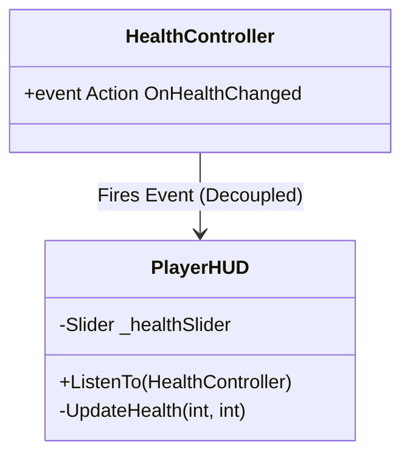

# UI & HUD System - Technical Doc

**Author:** Chief Systems Architect  
**Status:** Approved (Sprint-006, M4)  
**Target Engine:** Unity 6 / Unity 2022 LTS (UGUI or UI Toolkit)  
**Namespace:** `SoulHunter.UI`  

## 1. Architecture Overview
A common mistake in game development is tightly coupling the UI to the Player (e.g., `playerController.Health -= 10` updating the slider directly). In Soul-Hunter, we use the **Observer Pattern**. The UI only listens; it never commands gameplay.

## 2. Core Components
- **`PlayerHUD` (MonoBehaviour)**: Manages the visual UI elements (like Health Bars, Currency counters) on the screen.

## 3. The 2036 Test (Decoupling)
- If you delete the `Canvas` and `PlayerHUD` from the scene, the game must still compile and play perfectly without throwing `NullReferenceException`.
- The `PlayerHUD` does not `FindObjectOfType<PlayerController>()` in its `Update()` loop. Instead, a manager or the Player itself passes its `HealthController` reference to the HUD once upon spawning, and the HUD subscribes to the C# `OnHealthChanged` event.

## 4. Hybrid System Compliance
Because the HUD only updates when an event fires, there is **zero performance cost** during frames where health doesn't change. No continuous `Update()` polling is allowed for UI data binding.
