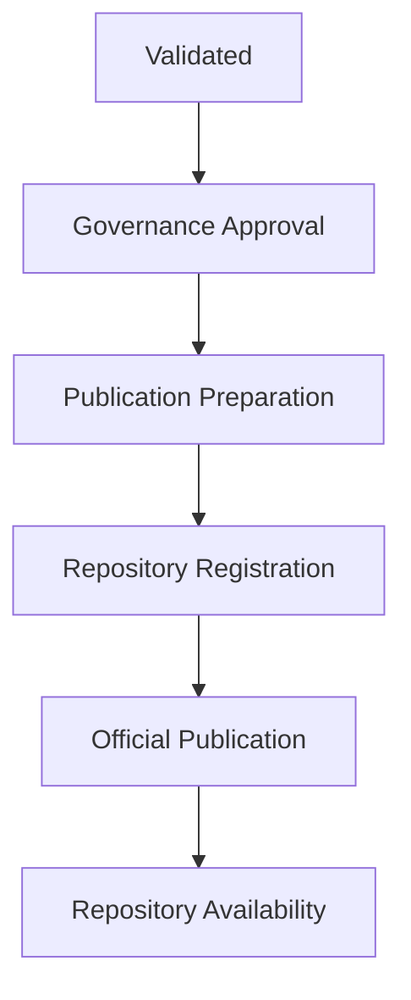

# Chapter 11 — Knowledge Package Publication

## 11.1 Purpose
The purpose of this chapter is to establish the Canonical Knowledge Package Publication Model (KPPM) governing the controlled publication, distribution, registration, versioning, and availability of Knowledge Packages within the SHRS Repository.

Publication transforms a validated Knowledge Package into an officially governed repository artifact available for repository consumption.

## 11.2 Objectives
The Knowledge Package Publication Model SHALL:
- Establish standardized publication procedures
- Ensure publication quality
- Preserve repository integrity
- Support version-controlled distribution
- Maintain publication traceability
- Enable repository-wide availability
- Facilitate long-term package preservation

## 11.3 Publication Principles
Knowledge Package publication SHALL conform to the following principles:
- Governance Approval
- Version Integrity
- Traceability
- Immutability
- Discoverability
- Controlled Distribution
- Auditability
- Constitutional Compliance

## 11.4 Publication Prerequisites
A Knowledge Package SHALL satisfy all of the following before publication:
- **Structural Validation**: PASS
- **Metadata Validation**: PASS
- **Manifest Validation**: PASS
- **Asset Validation**: PASS
- **Dependency Validation**: PASS
- **Governance Approval**: Complete
- **Lifecycle State**: Approved
- **Compliance Validation**: PASS

Publication SHALL NOT proceed until every prerequisite is satisfied.

## 11.5 Publication Workflow
The canonical publication workflow SHALL be completed sequentially:

## 11.6 Publication Package
The published Knowledge Package SHALL include:
- Package Manifest
- Package Metadata
- Knowledge Assets
- Governance Records
- Validation Report
- Publication Metadata
- Version Information

These artifacts SHALL collectively constitute the official publication.

## 11.7 Publication Metadata
Publication metadata SHALL include:

| Metadata | Required |
|----------|----------|
| Publication Identifier | Yes |
| Publication Version | Yes |
| Publication Date | Yes |
| Publication Status | Yes |
| Published By | Yes |
| Repository Edition | Yes |
| Baseline Reference | If Applicable |

Publication metadata SHALL become immutable after publication.

## 11.8 Repository Registration
Every published Knowledge Package SHALL be registered within the Repository Registry.
Registration SHALL include:
- Package Identifier
- Package Name
- Package Version
- Package Type
- Repository Location
- Publication Status

The registry SHALL serve as the authoritative catalog of published packages.

## 11.9 Version Publication
Every publication SHALL receive a unique version designation.
Examples:
- KPM Package v1.0
- KPM Package v1.1
- KPM Package v2.0

Published versions SHALL remain permanently identifiable.

## 11.10 Publication Status
Knowledge Packages SHALL use one of the following publication states:

| Status | Meaning |
|--------|---------|
| Pending Publication | Awaiting publication |
| Published | Officially released |
| Superseded | Replaced by newer version |
| Archived | Preserved for history |
| Withdrawn | Publication withdrawn |

Publication status SHALL remain governed.

## 11.11 Distribution
Published Knowledge Packages MAY be distributed through:
- Repository Libraries
- Repository Search Services
- AI Knowledge Services
- Curriculum Collections
- Learning Platforms
- Approved Repository APIs

Distribution SHALL preserve package integrity.

## 11.12 Publication Integrity
After publication:
- Published assets SHALL remain immutable.
- Package Manifest SHALL remain fixed.
- Publication metadata SHALL remain unchanged.
- Governance history SHALL remain preserved.

Modifications SHALL require publication of a new version.

## 11.13 Publication Audit
Repository publication SHALL maintain audit records including:
- Publication date
- Publication authority
- Publication version
- Validation reference
- Approval reference
- Distribution history

Publication audits SHALL remain permanently preserved.

## 11.14 Publication Governance
Publication SHALL be authorized only by the Repository Publication Authority.
Publication decisions SHALL:
- Reference completed validation
- Reference governance approval
- Update repository registries
- Preserve audit records

Unauthorized publication SHALL NOT be permitted.

## 11.15 Summary
The Knowledge Package Publication Model establishes the canonical publication framework for Knowledge Packages within the SHRS Repository. It ensures that every published package is validated, governed, version-controlled, traceable, discoverable, and permanently preserved while maintaining constitutional alignment with KRA-BL-001 and KAM-BL-001.
