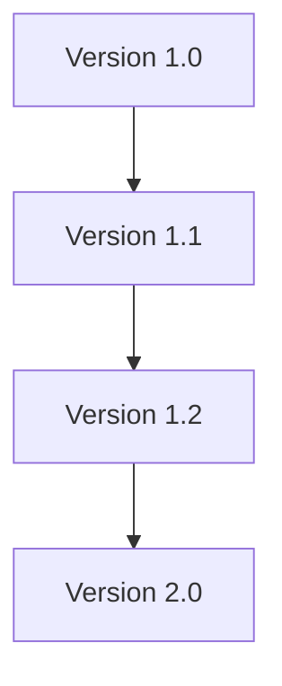

# Chapter 2 — Knowledge Package Evolution

## 2.1 Purpose
The purpose of this chapter is to establish the Canonical Knowledge Package Evolution Model (KPEM) governing the controlled evolution, revision, enhancement, modernization, and long-term sustainability of Knowledge Packages within the SHRS Repository.

Package evolution ensures that repository knowledge remains accurate, reusable, maintainable, and constitutionally compliant while preserving historical integrity.

## 2.2 Objectives
The Knowledge Package Evolution Model SHALL:
- Support controlled package evolution
- Preserve repository stability
- Maintain backward compatibility where applicable
- Enable continuous improvement
- Preserve historical baselines
- Facilitate governed innovation
- Ensure long-term maintainability

## 2.3 Evolution Principles
Knowledge Package evolution SHALL conform to the following principles:
- Controlled Change
- Backward Traceability
- Version Integrity
- Constitutional Compliance
- Governance by Design
- Historical Preservation
- Minimal Disruption
- Continuous Improvement

## 2.4 Evolution Triggers
Knowledge Package evolution MAY be initiated by:
- Curriculum changes
- New Knowledge Assets
- Obsolete content
- Governance improvements
- Repository architecture changes
- Dependency changes
- Technology-neutral repository enhancements

Every evolution SHALL have a documented justification.

## 2.5 Types of Evolution
The Repository recognizes the following evolution types:

| Evolution Type | Description |
|----------------|-------------|
| Corrective | Error correction |
| Adaptive | Responds to environmental change |
| Perfective | Improves quality or usability |
| Preventive | Reduces future maintenance risk |
| Structural | Improves package organization |
| Governance | Updates governance information |

Each evolution SHALL be classified before implementation.

## 2.6 Version Evolution
Every approved evolution SHALL result in an appropriate version update. Typical progression:

Version numbering SHALL follow repository versioning policies.

## 2.7 Baseline Preservation
Previous published versions SHALL remain preserved.
The Repository SHALL maintain:
- Original publication
- Revision history
- Validation records
- Governance records
- Publication records

Historical baselines SHALL remain immutable.

## 2.8 Asset Evolution
Evolution MAY include:
- Addition of Knowledge Assets
- Retirement of obsolete assets
- Replacement of outdated assets
- Metadata improvements
- Structural reorganization

Every asset modification SHALL remain traceable.

## 2.9 Dependency Evolution
Dependency evolution SHALL ensure:
- Compatibility with updated packages
- Removal of obsolete dependencies
- Introduction of new approved dependencies
- Validation of dependency integrity

Dependency changes SHALL undergo repository validation.

## 2.10 Manifest Evolution
The Package Manifest SHALL evolve whenever:
- Package contents change
- Metadata changes
- Dependencies change
- Governance changes
- Publication versions change

The updated manifest SHALL become authoritative for the new version only.

## 2.11 Governance During Evolution
Every evolution SHALL require:
- Approved change request
- Governance review
- Validation
- Publication approval
- Updated audit records

Unapproved evolution SHALL NOT be permitted.

## 2.12 Evolution Validation
Every evolved package SHALL undergo:
- Structural validation
- Metadata validation
- Dependency validation
- Governance validation
- Publication validation
- Compliance validation

Evolution SHALL NOT bypass repository validation.

## 2.13 Evolution Traceability
The Repository SHALL maintain traceability between:
- Previous versions
- Revised versions
- Replaced assets
- Updated dependencies
- Governance decisions
- Publication history

Complete evolution history SHALL remain permanently available.

## 2.14 Evolution Constraints
The following constraints SHALL apply:
- Published versions SHALL remain immutable.
- Evolution SHALL create a new version.
- Historical versions SHALL remain accessible.
- Baseline records SHALL NOT be altered.
- Governance approval SHALL precede publication.

Violation of these constraints SHALL constitute repository non-conformance.

## 2.15 Evolution Integrity
The Repository SHALL preserve:
- Historical continuity
- Version consistency
- Architectural integrity
- Governance traceability
- Repository stability

Evolution integrity SHALL remain mandatory throughout the package lifecycle.

## 2.16 Summary
The Knowledge Package Evolution Model establishes the canonical framework governing the controlled evolution of Knowledge Packages within the SHRS Repository. It ensures that repository knowledge evolves through governed, validated, version-controlled, and fully traceable processes while preserving constitutional alignment with KRA-BL-001, KAM-BL-001, and future repository baselines.

