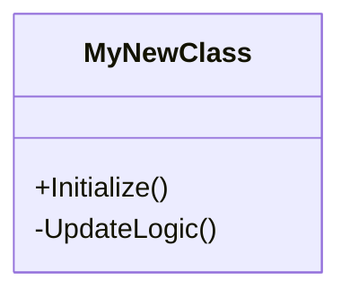

# Annex B: Technical Documentation Template

*This template SHALL be used when documenting Unity C# scripts, core architectures, or complex system integrations for Soul-Hunter.*

---

# [System / Script Name] - Technical Doc

**Author:** [Your Name]  
**Namespace:** `SoulHunter.Core.[Module]`  
**Dependencies:** [List any required scripts or packages]

## 1. Architecture Overview
*Provide a Mermaid Class Diagram or State Machine showing how this script interacts with the rest of the game.*

## 2. Core Components
*List the exact Unity components this system requires to function on a GameObject.*
- `Rigidbody`
- `BoxCollider` (IsTrigger: **True**)

## 3. Hybrid System / ECS Compliance
*Detail how this system adheres to the project's hybrid architecture rules and avoids runtime allocations.*

## 4. Integration with Bootstrap
*Explain how this system is registered or initialized via the BootstrapInstaller.*

## 5. Performance / Optimization Notes
!!! warning "Performance Note"
    *Mention any heavy operations like `GetComponent()` in `Update()`, Physics calculations, or Object Pooling requirements here.*

---
*(End of Template)*

