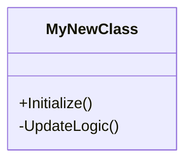

# Annex B: Technical Documentation Template

*This template SHALL be used when documenting Unity C# scripts, core architectures, or complex system integrations for Soul-Hunter.*

---

# [System / Script Name] - Technical Doc

**Author:** [Your Name]  
**Namespace:** `SoulHunter.Core.[Module]`  
**Dependencies:** [List any required scripts or packages]

## 1. Architecture Overview
*Provide a Mermaid Class Diagram or State Machine showing how this script interacts with the rest of the game.*

## 2. Core Components
*List the exact Unity components this system requires to function on a GameObject.*
- `Rigidbody`
- `BoxCollider` (IsTrigger: **True**)

## 3. Public API / Methods
*List the methods that other scripts are allowed to call.*

### `PublicMethodName(type arg)`
*Description of what the method does and what it returns.*

## 4. Inspector Variables
*List the variables exposed to the Unity Inspector so Game Designers know what to tweak.*

- `float moveSpeed`: The base speed of the entity (Default: **5.0f**).
- `GameObject deathVFX`: The prefab spawned upon destruction.

## 5. Performance / Optimization Notes
!!! warning "Performance Note"
    *Mention any heavy operations like `GetComponent()` in `Update()`, Physics calculations, or Object Pooling requirements here.*

---
*(End of Template)*
