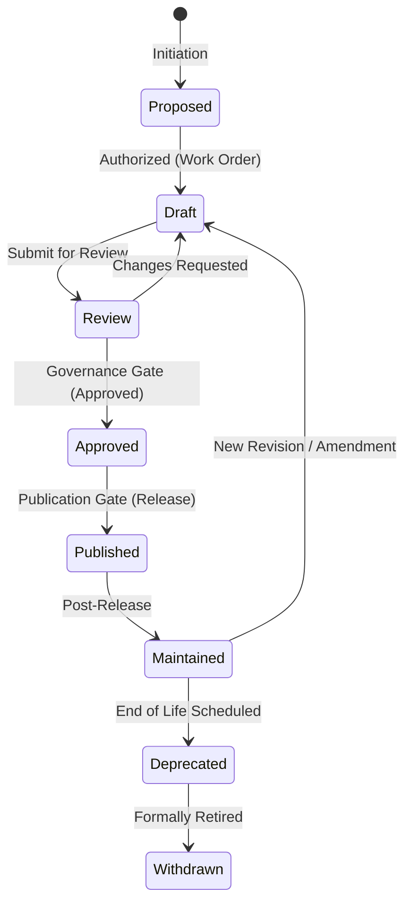

# Chapter 4 — Standards Lifecycle

Every SHRS Standard SHALL follow a strictly controlled Lifecycle State from its inception to withdrawal. This ensures that only verified, peer-reviewed, and approved content is published.

## 4.1 Lifecycle States

A Standard SHALL always exist in one of the following recognized Lifecycle States:
- **Proposed**: A new standard concept has been formally requested.
- **Draft**: Initial creation or active modification state.
- **Review**: The Standard is pending evaluation by an Approval Authority.
- **Approved**: The Governance Decision to accept the changes is recorded.
- **Published**: The Standard is available as a formal Edition.
- **Maintained**: The published Standard is actively monitored for minor corrections.
- **Deprecated**: The Standard is no longer recommended for active use but remains available for reference.
- **Withdrawn**: The Standard is formally retired and SHALL NOT be used.

## 4.2 State Transitions

Moving from one Lifecycle State to another SHALL require passing through a Governance Gate. These transitions SHALL be documented via a Governance Record.

The following diagram illustrates the canonical state transitions:

## 4.3 Versioning Strategy
Every transition and publication is tracked using precise terminology:
- **Edition**: Represents a major publication baseline.
- **Version**: A unique identifier tracking minor controlled states.
- **Revision**: A formal change made to an existing Draft.
- **Amendment**: A normative addition or structural modification made to a Published Edition.
- **Corrigendum**: A technical correction of errors or ambiguities in a Published Edition, which does not alter the core normative scope.
